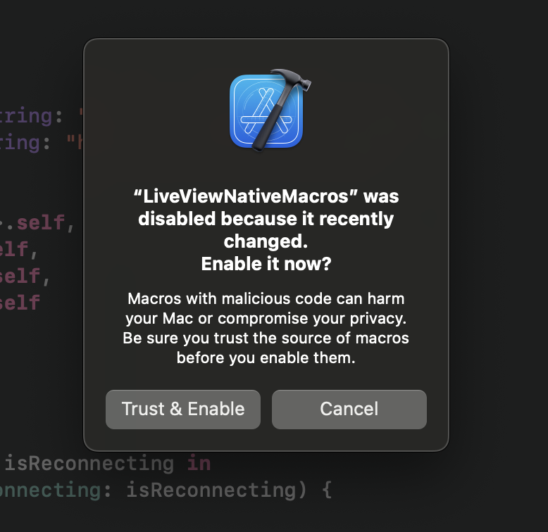
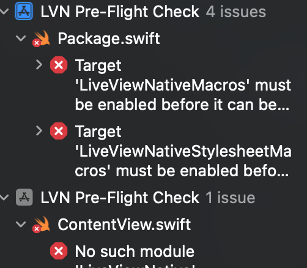

# LiveView Native - Pre-Flight Check

This Xcode proejct is used to ensure that someone has the proper Xcode environment set up
for participating in a LiveView Native workshop.

## Usage

1. Clone the repo
2. Open the `xcodeproj` in XCode.
3. Press the `►` button to start the simiulator

At this point you will likely bre prompted with a modal:

Click `Trust & Enable` and press `►` again.

You may see a new build failure. Click the red `X`

and on the left-hand gutter you will see two errors

Click on each and you will again be prompted with another `Trust & Enable` request. Agree to both and build again.

Once the simulator launches the very first app install will take up two a minute to launch. It
may appear as a blank screen. After the first time additional builds will run and launch faster.
